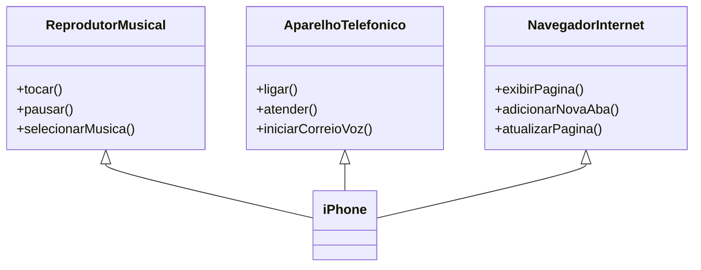

```mermaid
classDiagram
    ReprodutorMusical <|-- iPhone
    ReprodutorMusical: +tocar()
    ReprodutorMusical: +pausar()
    ReprodutorMusical: +selecionarMusica()

    AparelhoTelefonico <|-- iPhone
    AparelhoTelefonico: +ligar()
    AparelhoTelefonico: +atender()
    AparelhoTelefonico: +iniciarCorreioVoz()

    NavegadorInternet <|-- iPhone
    NavegadorInternet: +exibirPagina()
    NavegadorInternet: +adicionarNovaAba()
    NavegadorInternet: +atualizarPagina()
```
